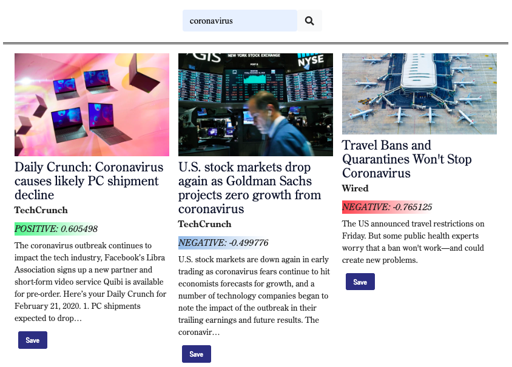

# News Polarizer

**A news research application built using NLU sentiment analysis to polarize coverage on a news headline.**

Built by the NewsIT Team, part of Columbia Engineering's Winter 2020 Full Stack Coding Bootcamp Class

* John Harper
* Alan Leverenz
* Ariel Quinones

## What the app does

News Polarizer applies sentiment score values to news articles. The purpose of the app is to present the user with a "polarized" view of news articles. A search returns articles with relative high, low, and middle sentiment scores. These articles include a color-shaded score value. The users can save returned articles, associated with their user login, and view all query results in a graph, with links to the article URL's.

## How the app is built

News Polarizer is built using a MERN stack (MongoDB, Express, React, and Node). User authentication is based on Express-Sessions. The MongoDB has three collections that serve the data: Article, Query, and User.

## How it works

Here is the deployed URL:

<http://news-polarizer.herokuapp.com/>

### Today's Headlines

The Home route (Today) activates an automatic search for current headlines, returning 12 articles. These articles are intended to give the user ideas on what current events they may wish to search for.

### Navbar

The Navbar enables the user to Signup or Login to begin searching, view saved articles or queries.

### Searching

News Polarizer collects news articles based on the search string.

* An API connection to RapidAPI news sources returns basic article metadata, such as title, source, author, description, url, image url, and date published.
* The articles are run through the IBM Watson NLU (Natural Language Understanding) sentiment analyzer, which accesses the article url and adds a sentiment score to the response.
* The articles with the highest and lowest score, and an article midway between the other two are presented to the user.

## Saving Articles

After a search is returned, by clicking on the Save button below an article the user is able to save the article so it can be viewed at a later date. Articles are saved in a Article collection.

## Viewing All Query Results

The app defaults to storing 12 articles for each search, which are saved in the Query collection. Each set of 12 pertaining to a search are represented in a dot graph. The dots are spaced in 12 columns. Their score is visualized by their vertical position (negative to positive) and color (reds = negative, blues = neutral, green = positive). Click on a dot to view its headline. Click on the headline to read the article.

To remove all 12 articles from the Query collection, simply click on the Delete button.
